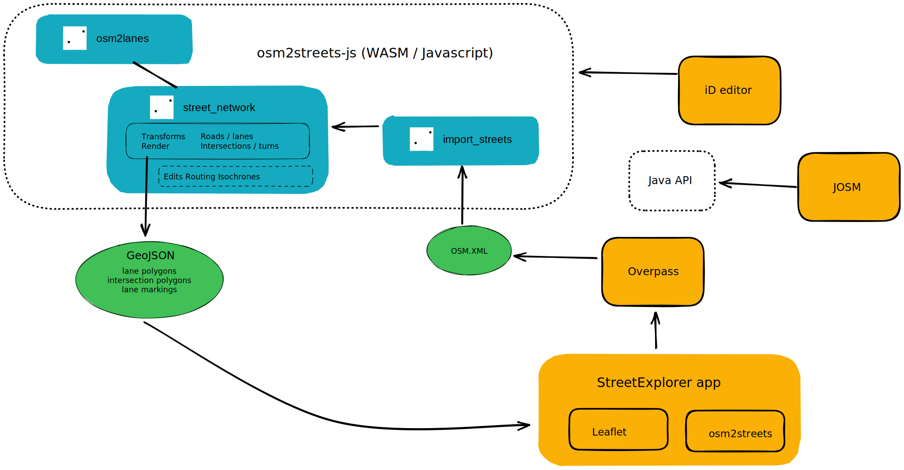

# osm2streets

OpenStreetMap (OSM) has many details about streets, but the schema presents
many challenges for rendering, routing, and analyzing done at the detail of
lanes, especially in the presence of dual carriageways, separated cycletracks
and footways, and complex intersections. `osm2streets` provides a simplified
street network schema, a library transforming OSM data into this representation,
and tools to render and work with the results.

## Getting started

1.  Open [StreetExplorer](https://a-b-street.github.io/osm2streets/)
2.  Select a test area from the left, then click **Reimport**
3.  Or navigate to anywhere in the world and press **Import current view**
    (change the driving side in **Settings** first)

## Features

- A schema able to represent:

  - **Roads** leading between two intersections
    - Thickened line-strings
    - A list of lanes from left-to-right, with: type, direction, width
  - **Intersections** linking roads
    - Polygon areas, with each road polygon intersecting at a perpendicular
      angle
    - _Planned: turning movements and crosswalks_
  - _Planned: bike boxes / advanced stop lines, pedestrian crossing islands, modal filters_

- Rendering to GeoJSON
  - Individual lane and intersection polygons
  - Lane markings: lines between lanes, schematic display of turn arrows and access restrictions
- Transformations to simplify complex OSM situations
  - Collapsing "unnecessary" intersections between 2 roads
  - Merging "sausage links" and dual carriageways into a single road
  - Merging "dog-leg" intersections and other short roads into one logical intersection
  - "Snapping" parallel cycletracks and footways to the main road

There are other planned features:

- routing (score functions can take advantage of knowing how a cycle lane is
  segregated from the road)
- isochrone / walkshed calculations
- map-matching GPS trajectories to routes
- tracing the area in between roads ("walking around the block")
- robustly representing user-created edits to the street network model, even
  when underlying OSM data is updated

Some of these extra features may sound redundant with libraries like
[osmnx](https://osmnx.readthedocs.io/en/stable/) and existing OSM routers.
osm2streets will support these features in a way that uses the lane-level
detail and consolidated road representation, is compatible with user-made edits
to the network, and can be deployed in a variety of environments (native, web,
offline without running an external server).

## Users

- [StreetExplorer](https://a-b-street.github.io/osm2streets/): a web app to
  interactively import OSM and explore the osm2streets output
- [A/B Street](https://abstreet.org): a collection of projects to design cities
  friendlier to walking, cycling, and public transit. `osm2streets` began life
  here.
- [Bus Spotting](https://github.com/dabreegster/bus_spotting): a bus network
  GTFS viewer, using `osm2streets` to snap routes to roads
- [MapLibre route snapper
  plugin](https://github.com/dabreegster/route_snapper/): draw line-strings
  snapped to the road network
- [osm2streets-vector-tileserver](https://github.com/jakecoppinger/osm2streets-vector-tileserver): Dynamically generate vector tiles and view with QGIS, Mapbox, etc
  - [safe-cycling-map](https://github.com/jakecoppinger/safe-cycling-map) is an example Mapbox use
- [lane editor](https://a-b-street.github.io/osm2streets/lane_editor.html) to edit OSM tags and see visual results
- [ATIP](https://github.com/acteng/atip): sketching active travel infrastructure, using `osm2streets` for contextual layers about speed and lane configuration
- _Planned: plugins for [iD](https://github.com/openstreetmap/iD) and
  [JOSM](https://josm.openstreetmap.de/) to display streets in detail and
  visually edit lane tagging_

### Using osm2streets in your projects

You can use osm2streets today with Leaflet, Mapbox, OpenLayers, or any other
web map frameworks. The [osm2streets Javascript
API](https://github.com/a-b-street/osm2streets/tree/main/osm2streets-js) can
render to GeoJSON.

Since the API isn't stable yet, please [get in
touch](https://github.com/a-b-street/osm2streets/issues/new) first.

[Java bindings](https://github.com/a-b-street/osm2streets/tree/main/osm2streets-java) are also in progress, with Python and C++ planned.

## Architecture

The osm2streets library itself (Rust):

- [osm2streets](https://github.com/a-b-street/osm2streets/tree/main/osm2streets) with the schema, transformations, rendering, etc
- [streets_reader](https://github.com/a-b-street/osm2streets/tree/main/streets_reader) to read `osm.xml` input
- [experimental](https://github.com/a-b-street/osm2streets/tree/main/osm2streets): an experimental crate for experimenting with implementation details.

Bindings for other languages:

- [osm2streets-js](https://github.com/a-b-street/osm2streets/tree/main/osm2streets-js): Javascript via WebAssembly
- _Planned: Java, Python, R_

The [StreetExplorer web app](https://a-b-street.github.io/osm2streets/) (Javascript, CSS using Leaflet):

- [web](https://github.com/a-b-street/osm2streets/tree/main/web): the Svelte web app
- [tests](https://github.com/a-b-street/osm2streets/tree/main/tests): regression tests covering complex OSM input

## Contributing

There's many opportunities to help out:

- writing and improving transformations of street networks
- adjusting the schema to represent bike boxes, modal filters, lanes that change width, etc
- designing how to render lane detail
- integrating the library into your own OSM tool
- adding test cases for representative situations requiring simplification

Check out the [issues](https://github.com/a-b-street/osm2streets/issues).

## Further reading

- An early article just about [intersection geometry](https://a-b-street.github.io/docs/tech/map/geometry/index.html)
- The [followup talk at FOSSGIS](https://dabreegster.github.io/talks/map_model_v2/slides.html) (March 2022)
- The State of the Map talk: [slides](https://dabreegster.github.io/talks/sotm_2022/slides.html), [video](https://www.youtube.com/watch?v=Te39lBuhPK8) (August 2022)
