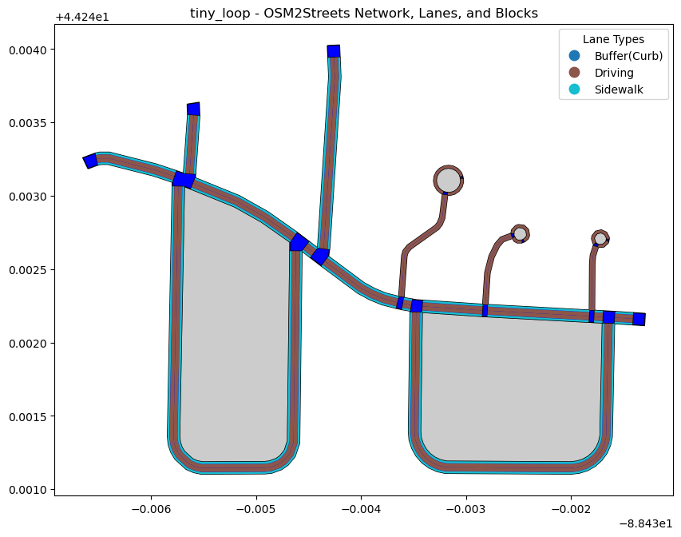
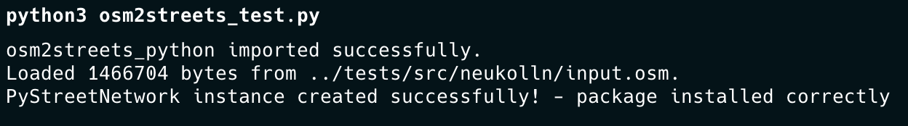

# osm2streets Python Module Documentation

The osm2streets_python module provides Python bindings for the osm2streets library using pyo3, allowing users to interact with OpenStreetMap (OSM) data and convert it into street network representations. The main classes, PyStreetNetwork and PyDebugStreets, offer methods for creating, transforming, and exporting street networks in GeoJSON format.




## Installation:

### Prerequisites

Before getting started, ensure that you have the following installed:
1.	Rust – Install using rustup.

```bash
curl --proto '=https' --tlsv1.2 -sSf https://sh.rustup.rs | sh
```

If you're using mac, make sure to also install:

```bash
rustup target add x86_64-apple-darwin
```

2. Set Up a Virtual Environment Using Conda/Venv (replace osm2streets-env with your environment name):

```bash
conda create -n osm2streets-env
conda activate osm2streets-env
conda install pip
conda install -c conda-forge geopandas geopy
```

4.	Install osm2streets_python using the following command:

```bash
pip install --no-cache-dir -e git+https://github.com/a-b-street/osm2streets.git#egg=osm2streets_python\&subdirectory=osm2streets-py
```

5. Verifying the Installation

Once installed, you can verify that the package works by running the osm2streets_test.py in the osm2streets-py folder:

```bash
python3 osm2streets_test.py
```
This should result in the following output: 

Success! You've installed the package and are now ready to use its functions. 


For some examples have a look at `osm2streets_py_test.ipynb`

Once installed you can import the module using:
```python
import osm2streets_python
```

### Currently available Classes and Methods in osm2streets_python

**`osm2streets_python.PyStreetNetwork`**

PyStreetNetwork represents the main street network structure, constructed from raw OSM data and transformation configurations.

- **`.new(osm_input, clip_pts_geojson, input)`**: Initializes a new `PyStreetNetwork`.
  - **`.osm_input`**: Byte array representing OSM data.
  - **`.clip_pts_geojson`**: Optional GeoJSON string defining the area to clip.
  - **`.input`**: JSON string parsed as `ImportOptions` to configure the import settings.

- **`.to_geojson_plain()`**: Exports the entire street network as a plain GeoJSON.

- **`.to_lane_polygons_geojson()`**: Exports lane polygons as a GeoJSON.

- **`.to_lane_markings_geojson()`**: Exports lane markings as a GeoJSON.

- **`.to_intersection_markings_geojson()`**: Exports intersection markings as a GeoJSON.

- **`.get_debug_steps()`**: Retrieves a list of `PyDebugStreets` objects representing each debugging step applied to the street network.

- **`.debug_clockwise_ordering_geojson()`**: Exports clockwise ordering information for intersections as a GeoJSON for debugging road connections.

- **`.debug_clockwise_ordering_for_intersection_geojson(intersection)`**: Exports clockwise ordering information for a specific intersection as a GeoJSON.
  - **`intersection`**: Intersection ID to be debugged.

- **`.debug_movements_from_lane_geojson(road, index)`**: Exports movement information from a specific lane as a GeoJSON.
  - **`road`**: Road ID containing the lane.
  - **`index`**: Lane index within the road.

- **`.debug_roads_connected_to_intersection_geojson(i)`**: Exports roads connected to a specified intersection as a GeoJSON.
  - **`i`**: Intersection ID.

- **`.get_osm_tags_for_way(id)`**: Retrieves OSM tags for a specified way as a JSON string.
  - **`id`**: OSM ID of the way.

- **`.to_json()`**: Exports the entire `StreetNetwork` structure as a JSON string.

- **`.get_geometry_for_way(id)`**: Retrieves the buffered geometry of a specified way as a GeoJSON.
  - **`id`**: OSM ID of the way.

- **`.way_to_xml(id)`**: Converts a specified way to an XML representation including its OSM tags.
  - **`id`**: OSM ID of the way.

- **`.find_block(road, left, sidewalks)`**: Finds and exports a block (polygon) on a specific side of the road.
  - **`road`**: Road ID.
  - **`left`**: Boolean indicating if the left side of the road should be used.
  - **`sidewalks`**: Boolean indicating if sidewalks should be included.

- **`.find_all_blocks(sidewalks)`**: Finds and exports all blocks in the network as GeoJSON polygons.
  - **`sidewalks`**: Boolean indicating if sidewalks should be included.

- **`.overwrite_osm_tags_for_way(id, tags)`**: Updates OSM tags for a specific way and applies changes to all affected roads and intersections.
  - **`id`**: OSM ID of the way.
  - **`tags`**: JSON string representing the new OSM tags.

- **`.collapse_short_road(road)`**: Collapses a specified short road by merging it with neighboring segments.
  - **`road`**: Road ID.

- **`.collapse_intersection(intersection)`**: Collapses an intersection if it connects only two roads.
  - **`intersection`**: Intersection ID.

- **`.zip_sidepath(road)`**: Zips a sidepath (e.g., a bike lane or sidewalk) alongside a specified road.
  - **`road`**: Road ID containing the sidepath.

**`osm2streets_python.PyDebugStreets`**

PyDebugStreets provides debugging utilities for inspecting and visualizing specific street network elements.


- **`.get_label()`**: Returns a label for the debug street.
- **`.to_debug_geojson()`**: Exports debug information as GeoJSON, if available.


### Extending the python package (Compiling a Python Package from Rust Using maturin)

#### Step 1: Install maturin in your virtual environment.

```bash
pip install maturin
```

#### Step 2: Check that the Rust Project is Organised for Building

In your Rust project, ensure the following structure for Python bindings using pyo3:
```
osm2streets-py/
├── Cargo.toml          # Contains the package information
├── pyproject.toml      # Contains build information for pip
└── src/
    └── lib.rs          # Main Rust library file where Python bindings are defined
```

Your `Cargo.toml` is already set up. It should specify pyo3 and be configured to building as a Python package. Here’s the current status. Add dependencies and additions where needed:

```toml
[package]
name = "osm2streets_python"
version = "0.1.0"
edition = "2018"

[dependencies]
abstutil = { git = "https://github.com/a-b-street/abstreet" }
geom = { workspace = true }
osm2streets = { path = "../osm2streets" }
streets_reader = { path = "../streets_reader" }
pyo3 = { version = "0.17", features = ["extension-module"] }
serde = { version = "1.0", features = ["derive"] }
chrono = { version = "0.4", features = ["serde"] }
serde_json = "1.0"
env_logger = "0.10"

[lib]
crate-type = ["cdylib"]
```

In your `src/lib.rs`, set up the pyo3 bindings. Here’s a simple example:

```rust
use pyo3::prelude::*;
use osm2streets::{
    StreetNetwork,
};

#[pyclass]
pub struct PyStreetNetwork {
    inner: StreetNetwork,
    ways: BTreeMap<osm::WayID, streets_reader::osm_reader::Way>,
}

#[pymethods]
impl PyStreetNetwork {
pub fn to_geojson_plain(&self) -> PyResult<String> {
        self.inner.to_geojson(&Filter::All).map_err(|e| PyErr::new::<pyo3::exceptions::PyRuntimeError, _>(format!("{}", e)))
    }
}

#[pymodule]
fn osm2streets_python(_py: Python, m: &PyModule) -> PyResult<()> {
    m.add_class::<PyStreetNetwork>()?;
    Ok(())
}
```

#### Step 3: Build the Python Package with maturin

1.	Build and Install the Package:
Inside the project directory, run maturin develop to compile and install the package in your active environment.

```bash
maturin develop
```
- `maturin develop` compiles the package in development mode and installs it in the environment, allowing you to test it directly.

2.	Check the Installation:
Verify the package is installed and accessible by importing it in Python:


```python
import osm2streets_python
```

### Troubleshooting Tips

- Compilation Errors: Ensure that Rust and Python versions match the requirements and that pyo3 is configured correctly.
- Dependency Errors: Double-check dependencies in Cargo.toml and install any missing Python packages in the virtual environment.
- Testing Errors: Run maturin develop again if you modify the Rust code to ensure changes are updated in the environment.